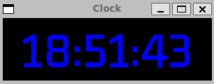

# Clock

Just a digital clock in under a hundred lines of C++ code.

Requires [SFML](https://www.sfml-dev.org/) library.

Uses [Kdam Thmor Pro](https://fonts.google.com/specimen/Kdam+Thmor+Pro?preview.text=123456) font.

## Linux (WSL):

## Windows:

